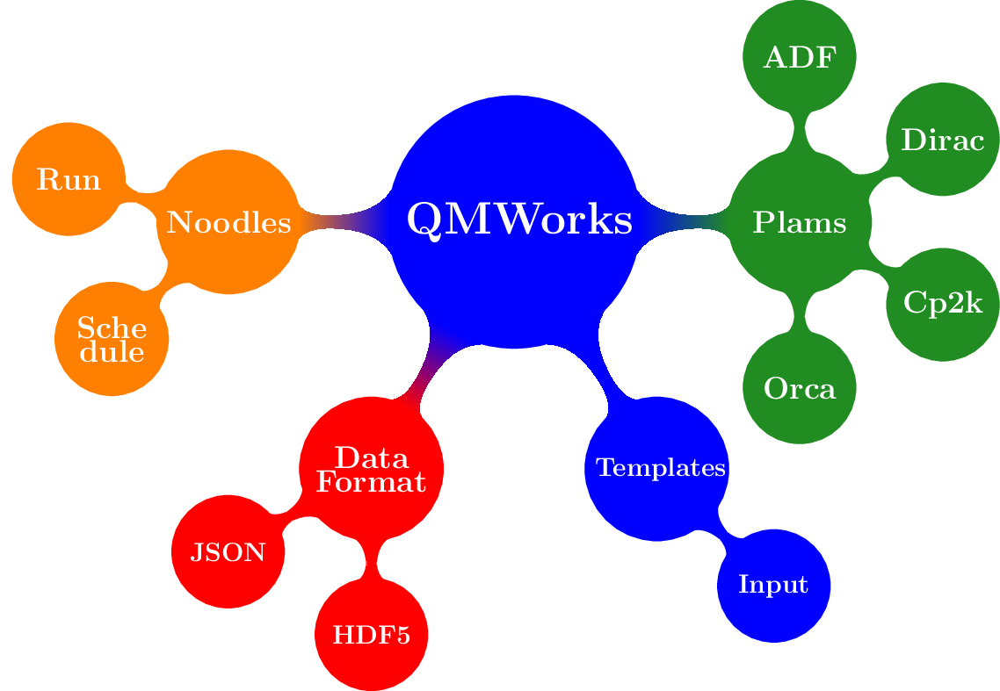
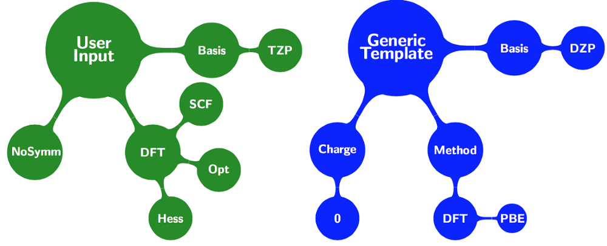
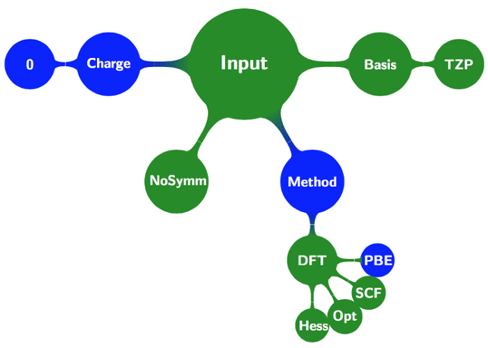

What is QMWorks?
================

Research on modern computational quantum chemistry relies on a set of computational tools to carry out calculations. The complexity of the calculations usually requires
intercommunication between the aforementioned tools, such communication is usually done through scripts  (e.g. Bash, Python, Perl, etc.) that try to automatize input/output actions like: launching the computations in a cluster, reading the resulting output and feeding the relevant numerical result to another program. Such scripts are difficult to maintain and extend, requiring a significant programming expertise to work with them. Being then desirable a set of automatic and extensible tools that allows to perfom complex simulations in heterogeneous hardware plaftorms. This library tackles the construction and efficient execution of computational chemistry workflows.

This allows computational chemists to use the emerging massively parallel compute environments in an easy manner and focus on interpretation of scientific data rather than on tedious job submission procedures and manual data processing. In this context, **QMWorks** stands as a robust and flexible python library, that allows both begginers and experts to automate the following tasks:

* Input generation (*Plams* and *Templates*)
* Dependencies management (*Noodles*).
* Effcient data storage (*HDF5*).
* Distribution in heterogeneous hardware platforms.
* Jobs failure detection and recovery.
* Control over the granularity of parallelism.

  
.. _tutorial:
  
Tutorial
========
In this tutorial we will walk through some minimal examples that show the **QWORKS** Capabilities and philosophy. like single point calculations, geometry optimizatios,
transition state optimizations, etc. Before we starts with computational chemistry calculation we first need to review the Templates concept.

.. Important::
  *QMWorks* is unaware about the installation and loading of the simulation packages that you want to use. It assumes that you somehow have accessed to the executables for the different packages that *QMWorks* has an interface with: ADF, Dirac, CP2K and Orca.  

.. _`tutorial templates`:

Working with templates
~~~~~~~~~~~~~~~~~~~~~~
**QMworks** offers a :ref:`templates` set that contains some default values for the most frequent calculation in computational chemistry: single point, geometry optimization, TS optimization, frequency calculations, etc.In order to understand the logic behind the templates, suppose that you want to carry out a calculation, like an optimization follow by frequencies calculation.  Also, you want to use a predifined generic template that contains details that some defaults like numerical tolerance, number of scf cycles, etc.  In the figure below you can see an schematic representation of the user input and the generic template. *QMWorks* will take your input and overlay it with the template that you have pick from the default :ref:`templates`.

This overlay will merge your keywords with the template keywords in such a way that if a property or method is present in either one of the two set the property or method will be part of the final input. On the other hand if a property or method is presented in both input sets  *the user keyword always has preference over the template* as depicted in the figure below
	   

The input keywords are specified using the |Settings| class. |Settings| is a :mod:`dict` subclass that represent the data in a hierarchical tree-like structure. for example ::

  from qmworks import Settings, templates

  s = Settings()  # (1)
  # generic keyword 
  s.basis = "DZP"  #  (2)
  # "specific" allows the user to apply specific keywords for a package
  s.specific.adf.basis.core = "large"  # (3)

  input = templates.singlepoint.overlay(s)  # (4)
  
The above code snippet shows how to create a |Settings| instance object in **(1)**, then in **(2)** the generic keyword *basis*  declares that the "DZP" should be used together with the *large* keyword
of *ADF* as shown at **(3)**. Finally in line **(4)** the user's keywords are merged with the defaults resultin in a input like ::

  Basis
    Core large
    Type DZP
  End

  Integration
    Accint 4.0
  End

  Scf
    Converge 1e-06
    Iterations 100
  End

  Xc
   Lda
  End

  
A simple Example
~~~~~~~~~~~~~~~~
Suppose you have a water molecule and you want to calculate a first approximation to the structure of minimal energy (e.g. using DFTB), then using this first approximation you want to perform a more accurate calculation for the optimized structure. In this section we will explore that simple *Workflow*, so fire up your favorite editor an copy the following code snippet to it: ::

  from qmworks import Settings, templates
  from plams import Molecule
  import plams

  # User Defined imports
  from qmworks.packages.SCM import adf, dftb
  from qmworks.packages import run

  plams.init()   # (1) 

  h2o = Molecule('h2o.xyz', 'xyz')  # (2)

  h2o_geometry = dftb(templates.geometry, h2o)  # (3)

  s = Settings() #  (4)
  # generic keyword "basis" must be present in the generic dictionary
  s.basis = "DZP"
  # "specific" allows the user to apply specific keywords for a
  # package that are not in a generic dictionary
  s.specific.adf.basis.core = "large"

  # (5)
  h2o_singlepoint = adf(templates.singlepoint.overlay(s), h2o_geometry.molecule)

  )
  dipole = h2o_singlepoint.dipole  # (6)

  final_result = run(dipole, n_processes=1)  # (7)

  print(final_result)

*QMWorks* uses the *Plams* package for both generating the input and calling the package that do the ``ab initio`` simulation.  *Plams* has an ``init`` function as shown in **(1)**, that initialize its enviroment and set all the variables to do the booking of creating unique folders, keeping track of the files, etc. that is required to do an ``ab initio`` simulation. Also, *QMWorks* use the *Plams* Molecule to store among other possible thing the molecular geometry coordinates. As shown at **(2)** the Molecule object is initialized with a path to the file containing the geometry and a string stating that file is of type ``xyz``. 

In line **(3)** the *QMWorks* starts to show its power by declaring that a DFTB calculation is going to be carry out using as arguments the defaults available at `~qmworks.templates.geometry`

As Previously discussed in the `tutorial templates`_ section

.. Hint::
  One noteworthy features of *QMWorks* is that it uses *Python3.5* if you have previous experience with *Python2.* and want to know what are the mayor diferences have a look at python2andpython3_.

Finally in Line **(7)** 

.. toctree::
   running

A more Advance Example
~~~~~~~~~~~~~~~~~~~~~~

.. _python2andpython3: https://wiki.python.org/moin/Python2orPython3

.. _Plams: 
